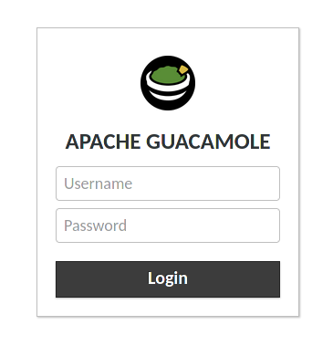
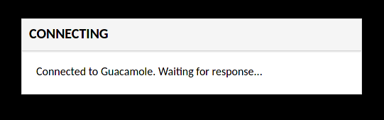
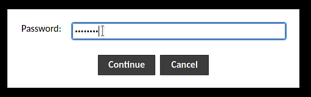
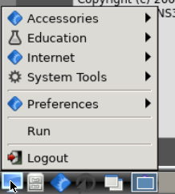
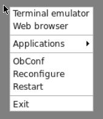

# What's this?
The goal of this repository is to provide a fast and easy way to set up a GNS3 virtual machine which the user can then connect to (graphically) via their web browser. 
Currently, the tools provided consist of provisioning scripts for **Vagrant** and **cloud-init**.

# Dependencies
In order to use the tools/scripts provided in this repository, you first have to install a few dependencies onto your system, depending on the framework you wish to use.

## Vagrant
You can find an installation guide for your platform on the [downloads](https://www.vagrantup.com/downloads) page of the Vagrant website.

## Cloud-init
If you intend to set up GNS3 using cloud-init, a simple solution would be to install [Multipass](https://multipass.run/).  
Most cloud providers, such as [Amazon Web Services](https://aws.amazon.com/), [Microsoft Azure](https://azure.microsoft.com/en-us/) and [Oracle Cloud](https://www.oracle.com/cloud/), however, support it as a part of their virtual machine setup process and allow you to bootstrap a script of your choice onto the cloud setup process. Please refer to the relevant provider's documentation for more information on the matter.

After the dependencies are hopefully taken care of, make sure you have cloned this repository (you will find the instructions, as well as an option to download the whole repository as a zip file, on the top of this page in the Code dropdown menu - next to the About section). 

# The passwords!
When you get your hands on the contents, there is but one tiny thing, although very important, still for you to do before you jump into action. And that is ***to change the provided passwords***! Even if you are only going to be using your soon-to-be-created virtual machine on your local computer, do it for the sake of principle.

## Vagrant
You will find the default passwords on the very top of the [provision.sh](provision.sh) script. To be precise, the passwords you are encouraged to change are the GUACAMOLE_ADMIN_PASSWORD and VNC_CONNECTION_PASSWORD environment variables, which, probably unsurprisingly, dictate the admin guacamole password[^1] and the password you will need when connecting to the machine.
## cloud-init
The procedure to set up passwords for cloud-init differs a bit from the Vagrant alternative. In the [cloud-config.yaml](cloud-config.yaml) file: 
* on line 108, change the text between the quotes according to your liking. It will represent the Guacamole admin password. The default value is **Ge5L0**.
* on line 240, the text on the right side of the equals (`=`) sign will be your VNC connection password. The default value is **GNS3jeZ4k0n**.

# Let's begin
Having set your desired passwords, you may now run the provision process. Please **be patient**, as it may take up to ten minutes or even more in some cases, depending on the speed/quality of your internet connection. If working on your local computer, the procedure goes as follows.

## Vagrant
Run the following command in the directory containing your [Vagrantfile](Vagrantfile) and [provision.sh](provision.sh):  
```
vagrant up
```
After Vagrant does its work, your new and shiny virtual machine will be accessible via your web browser at **localhost:8088/guacamole**[^2].

## cloud-init
If using multipass, execute the following command in the directory containing [cloud-config.yaml](cloud-config.yaml):
```
multipass launch 20.04 --cloud-init cloud-config.yaml
```
After the machine has started[^3], run
```
multipass list
```
to show some important information about the created virtual machine. Specifically, you are looking for the machine's IP address. For example, if you get an output like this:
```
Name                    State             IPv4             Image
happy-drake             Running           10.176.100.69    Ubuntu 20.04 LTS
``` 
you should soon be able to access your machine via the browser at **http://10.176.100.69:8080/guacamole**.

# Getting there
## The gatekeeper
If everything went ok, you should be welcomed by this page upon connecting:  
  
Log in as **admin** with the password you specified earlier.

Upon successful login you will be required to enter the VNC connection password. After that, a VNC session will be started, connecting you with the virtual machine's desktop.  



## Using the environment
")
GNS3 will automatically start, opening the project creation dialog. You can then use GNS3 as you would normally.  
You are also provided with **Wireshark**, should you need it for packet capture, and **Midori** for browsing the web. As for now, using some kind of network storage services (e.g. [Google Drive](https://drive.google.com), [Dropbox](https://www.dropbox.com), etc.) via the web browser is the only way of transferring files between the VM and the host.

You can access applications[^4] via the bottom panel menu or by right-clicking on the desktop area.
 

# A peek under the hood
The scripts aim to create a (headless) virtual machine running Ubuntu 20.04. Some of the included software packages that are worth mentioning:
* Display server: [Xorg](https://www.x.org/wiki/)
* Window manager: [Openbox](http://openbox.org/wiki/Main_Page) with the **Xcompmgr** composite manager, featuring the [LXPanel](https://github.com/lxde/lxpanel) desktop panel
* Greeter: 
  - [Slim](https://en.wikipedia.org/wiki/SLiM) (if using Vagrant)
  - [Unity greeter](https://github.com/canonical/lightdm) - as a part of LightDM (if using cloud-init)
* VNC Server: [x11vnc](https://github.com/LibVNC/x11vnc)

[^1]: No, we are not a Mexican restaurant, you will learn more about Guacamole later :slightly_smiling_face:
[^2]: Although the server, responsible for providing access to the box's desktop, actually runs on port 8080, it is forwarded to port 8088 as port 8080 is a port quite commonly in use and may as such already be occupied by some other software on your computer. If you run into errors nevertheless, e.g. if you get a message about Vagrant not being able to forward the specified port, you can always change the *host* port on line 31 of Vagrantfile, run `vagrant up` again and use that port to connect to the VM instead.
[^3]: If after some time multipass throws a message like `launch failed: The following errors occurred: timed out waiting for initialization to complete` at you, your machine is most probably still getting set up and is just taking a lot of time. In that case, just try connecting as described, the `multipass list` command will still work. If the installation has finished, you will be presented with the Guacamole login screen. If not, give the process some more time and try again after a minute or two.
[^4]: All mentioned applications, including GNS3, are available in the `Internet` submenu. A file manager and a terminal emulator can be found under `Utilities`. You can use **nano** (available via the terminal emulators) and **vim** for editing files.
